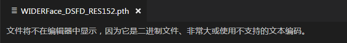

```{r}
suppressMessages(source(here::here("R/load.R")))
```

```
(face_recognization) D:\work\FaceDetection-DSFD>python demo.py
loading pretrained resnet model
Traceback (most recent call last):
  File "demo.py", line 248, in <module>
    test_oneimage()
  File "demo.py", line 197, in test_oneimage
    net.load_state_dict(torch.load(args.trained_model))
  File "D:\software\anaconda\envs\face_recognization\lib\site-packages\torch\ser
ialization.py", line 368, in load
    return _load(f, map_location, pickle_module)
  File "D:\software\anaconda\envs\face_recognization\lib\site-packages\torch\ser
ialization.py", line 542, in _load
    result = unpickler.load()
  File "D:\software\anaconda\envs\face_recognization\lib\site-packages\torch\ser
ialization.py", line 505, in persistent_load
    data_type(size), location)
  File "D:\software\anaconda\envs\face_recognization\lib\site-packages\torch\ser
ialization.py", line 114, in default_restore_location
    result = fn(storage, location)
  File "D:\software\anaconda\envs\face_recognization\lib\site-packages\torch\ser
ialization.py", line 95, in _cuda_deserialize
    device = validate_cuda_device(location)
  File "D:\software\anaconda\envs\face_recognization\lib\site-packages\torch\ser
ialization.py", line 79, in validate_cuda_device
    raise RuntimeError('Attempting to deserialize object on a CUDA '
RuntimeError: Attempting to deserialize object on a CUDA device but torch.cuda.i
s_available() is False. If you are running on a CPU-only machine, please use tor
ch.load with map_location='cpu' to map your storages to the CPU.
```

需要修改

```{r, child="map_location_cpu.Rmd"}
```


在 `demo.py` 中，

```
parser.add_argument('--trained_model', default='weights/WIDERFace_DSFD_RES152.pth'
```

这个`.pth`文件打不开，进行参数修改。

这个怎么修改，立功兄你知道吗？ torch 这个框架不熟悉。

```{r eval=FALSE, include=FALSE}
webshot::webshot("file:///D:/work/FaceDetection-DSFD/analysis/installation.html")
```

这个文件大小为


```{r}
dir_info("../weights")
```

还挺大的。

我认为应该不是导入这个文件，再去修改参数，因为这样很费时。
应该是在导入前就预处理好

```{r, child="map_location_cpu.Rmd"}
```

目前编译器打不开，如图。

```{r}

```


